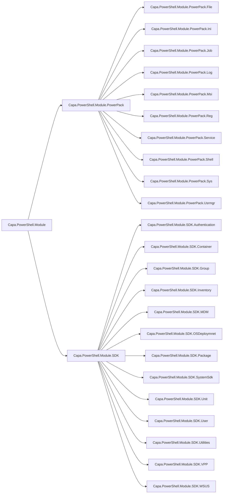

# Hvad er et PowerShell modul?

* Kan være bygget op paa mange måder
* For det meste arbejder jeg med at lave PSM1 (PowerShell Module) & PSD1 (PowerShell Manifest) filer

---

## Hvad er en PSM fil?

* Filen der indeholder ens kommandoer
* Ligner meget et script

---

## Hvad er en PSD fil?

* Module manifest - Indeholder information om modulet

Et lille eksempel på en PSD fil:

```powershell
@{
RootModule             = '.\Capa.PowerShell.Module.PowerPack.Exit.psm1'

ModuleVersion          = '1.0.20.0'

GUID                   = 'cfec6bfc-9715-4066-8923-96b581ea3627'

Author                 = 'Mark5900'

Description            = 'PowerShell module for CapaInstaller PowerPacks containing functions for Exit codes.
For more information, see https://capasystems.atlassian.net/wiki/spaces/CI65DOC/pages/19462455297/PowerShell+Scripting+Library'

PowerShellVersion      = '7.0'

DotNetFrameworkVersion = '4.6.2'

RequiredModules        = @(@{ ModuleName = 'Capa.PowerShell.Module.PowerPack.File'; RequiredVersion = '1.0.20.0'; })

FunctionsToExport      = 'Exit_RetryLater',
'Exit_ApplicationAlreadyInstalled',
'Exit_RebootRequested',
'Exit_MissingDiskSpace',
'Exit_CommandSucceded',
'Exit_ModuleNotFound',
'Exit_CommandNotDelivered',
'Exit_CommandObsolete',
'Exit_CommandTimedOut',
'Exit_CommandFailed',
'Exit_CommandHandlingFailed',
'Exit_CommandNotRecognized',
'Exit_PowerShellExecutionFailed',
'Exit_PackageNotCompliant',
'Exit_PackageCancelled',
'Exit_PackageFailedInstall',
'Exit_PackageFailedUninstall'
}
```

---

## Modul opbygning og struktur


